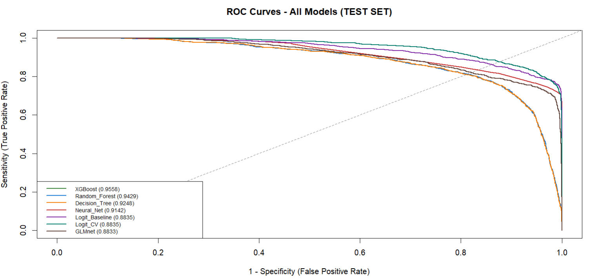
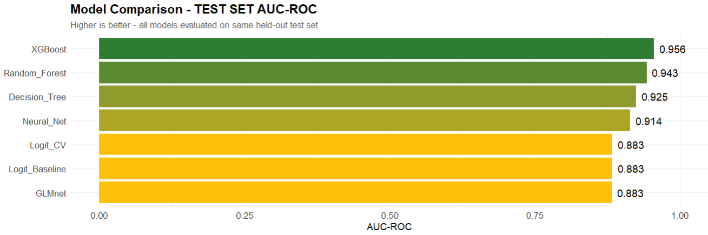
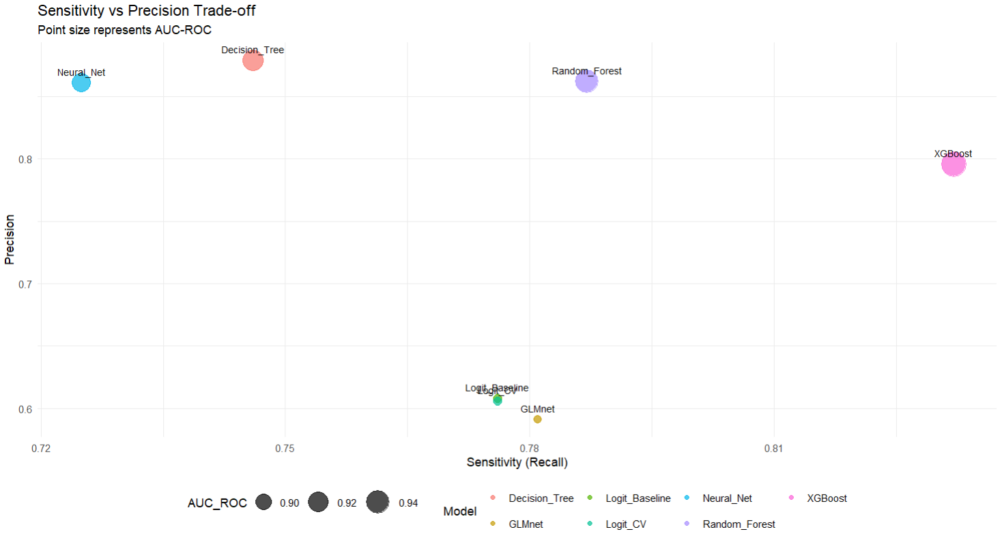

# Credit Default Prediction – Model Comparison


[]()
[]()

## 1. Project Overview

This project builds and compares several supervised machine-learning models for **predicting credit default risk at the individual-loan level**.  
The primary goal is to identify the **best-performing and practically usable model** for default prediction, and to translate the results into **business-oriented credit-risk insights**.

Concretely, the project:

- Trains multiple classification models on the same dataset and data splits.
- Evaluates them using both statistical metrics and business-relevant criteria.
- Highlights how different decision thresholds affect **approval rate vs. default rate**.
- Provides a recommended model and suggested operating points for credit policy.

---

## 2. Business Problem

A lender must decide whether to **approve, decline, or price a loan** based on borrower and loan characteristics at origination.

Key business questions:

- How accurately can we estimate the probability that a borrower will default?
- Which borrower and loan characteristics are the main **drivers of default risk**?
- How does changing the **approval threshold** affect:
  - The share of applicants approved,
  - The default rate among approved loans,
  - And the overall risk–return profile of the portfolio?

The outputs of this project are intended to support **credit underwriting**, **pricing**, and **risk policy** decisions.

---

## 3. Data

- **Source:** Kaggle – *Credit Risk Dataset*  
  https://www.kaggle.com/datasets/laotse/credit-risk-dataset
- **Target variable:** `loan_status`  
  - `0` – non-default  
  - `1` – default

**Main feature groups:**

- **Applicant profile:** age, income, employment length, home ownership, credit history.  
- **Loan characteristics:** amount, interest rate, grade, purpose (loan intent).  
- **Credit bureau / behavior:** default on file, credit history length, other derived features.

**Preprocessing (high level):**

- Handling missing values and basic data-quality issues.
- Type conversion (numeric / factor / ordered factor where relevant).
- Train / validation / test split with **stratification on `loan_status`** to preserve class imbalance.

> **Note:** The raw CSV is not included in the repository.  
> To reproduce the analysis, download the dataset from Kaggle and place it under `data/raw/credit_risk_dataset.csv`.

---

## 4. Modeling Approach

1. **Exploratory Data Analysis (EDA)**
   - Target distribution and class imbalance.
   - Distribution of key features and simple risk patterns.
   - Basic data sanity checks.

2. **Preprocessing & Feature Engineering**
   - Encoding of categorical variables.
   - Scaling / standardization for algorithms that require it.
   - Creation of train, validation, and test sets.

3. **Model Training & Tuning**
   - Implemented in **R**, using `caret` and model-specific packages.
   - Hyperparameter tuning via cross-validation on the **validation set**.
   - Handling class imbalance via class weights / resampling strategies (where relevant).

4. **Model Evaluation & Comparison**
   - Main metrics:
     - ROC-AUC, PR-AUC
     - Accuracy, Sensitivity (Recall), Specificity
   - Threshold selection:
     - Statistical: Youden’s J statistic on the validation set.
     - Business: approval-rate vs. default-rate trade-offs.
   - Final comparison on the **hold-out test set** only.

---

## 5. Models Compared

The project compares several model families on the same data and splits:

- **Baseline Logistic Regression**
- **Regularized Logistic Regression** (LASSO/Ridge)
- **Decision Tree** (conditional inference tree)
- **Random Forest**
- **Gradient Boosting / XGBoost**
- **Neural Network** (shallow MLP via `nnet`)

Each model is trained and tuned separately, then evaluated on the **same test set**, to ensure a fair comparison.

---

## 6. Key Evaluation Plots

This section presents four core plots used to understand model performance and risk trade-offs on the test set.

### 6.1 ROC Curves – Test Set



**Description:**  
Receiver Operating Characteristic (ROC) curves for all models on the **test set**.  
- The closer a curve is to the **top-left corner**, the better the discrimination between default and non-default.  
- The **area under the curve (AUC)** summarizes overall ranking quality across all thresholds.  
- Models with consistently higher ROC curves and AUC values are preferred from a pure ranking perspective.

---

### 6.2 AUC-ROC Comparison – Test Set



**Description:**  
Bar / point comparison of **AUC-ROC** across all models on the **test set**.  
- Each bar represents one model’s overall ability to rank risky vs. non-risky loans.  
- This plot allows a quick comparison of which model family performs best in terms of discrimination.  
- The recommended model is chosen among the top performers, taking into account both AUC and business considerations.

---

### 6.3 Sensitivity–Precision Trade-off – Test Set



**Description:**  
Sensitivity–Precision trade-off by model on the **test set** (each point represents a model at a chosen operating threshold).  
- **Sensitivity (Recall):** share of true defaults correctly identified as high risk.  
- **Precision:** share of predicted high-risk loans that actually default.  
- This view highlights how each model behaves at realistic decision thresholds and how different models support **conservative vs. aggressive** credit policies.

---

### 6.4 XGBoost – Test Confusion Matrix


**Description:**  
Confusion matrix for the **XGBoost model** on the **test set**, at a representative operating threshold.  
- Shows counts of **True Positives, False Positives, True Negatives, and False Negatives**.  
- Helps translate model performance into concrete business terms:
  - How many defaults are caught vs. missed.
  - How many good customers are incorrectly flagged as high-risk.  
- This is useful for discussing the model with business stakeholders and aligning on acceptable error trade-offs.


## 7. Business Implications

The technical comparison is translated into **credit-risk and business implications**.

### 7.1 Recommended Model

- **Recommended model:** `<MODEL_NAME>` (e.g., Regularized Logistic / XGBoost).  
- Rationale:
  - Strong and stable performance on **ROC-AUC and PR-AUC**.
  - Reasonable calibration on the test set.
  - Balance between **predictive power** and **interpretability / operational simplicity**.

### 7.2 Threshold Scenarios (Illustrative)

Using the recommended model, we can simulate different decision thresholds on the **test set**:

- **Conservative policy (low risk appetite)**
  - Higher cut-off (e.g., PD > 0.35 classified as “default”).
  - Lower approval rate, lower default rate among approved loans.
  - Suitable when the bank prioritizes **portfolio quality** and capital protection.

- **Balanced policy**
  - Medium cut-off (e.g., PD > 0.30).
  - Balanced trade-off between approval rate and risk.
  - Suitable for “standard” credit policy.

- **Aggressive growth policy**
  - Lower cut-off (e.g., PD > 0.25).
  - Higher approval rate but higher default rate among approved loans.
  - Appropriate in growth phases, or when pricing and collateral cover part of the additional risk.

> The exact thresholds and resulting approval / default rates should be calibrated to the bank’s **risk appetite**, **pricing strategy**, and **regulatory constraints**.

### 7.3 Practical Use Cases

- **Underwriting:**  
  Use predicted PD as an additional input to approve / decline decisions, alongside business rules and manual review.

- **Risk-based Pricing:**  
  Map PD bands to **interest rate** or **fees**, aligning price with expected loss.

- **Portfolio Monitoring:**  
  Track distribution of PDs over time, and flag **deterioration in new-book quality**.

- **Policy Simulation:**  
  Before changing approval rules, simulate the impact on approval volume and expected default rate.

---

## 8. Repository Structure

The repository is organized to separate code, data, outputs, and figures:

```text
.
├── R/
│   ├── 01_load_and_clean_data.R
│   ├── 02_exploratory_data_analysis.R
│   ├── 03_feature_engineering_and_splits.R
│   ├── 04_model_logistic_regression.R
│   ├── 05_model_regularized_logit.R
│   ├── 06_model_decision_tree.R
│   ├── 07_model_random_forest.R
│   ├── 08_model_xgboost.R
│   ├── 09_model_neural_network.R
│   ├── 10_model_calibration_and_thresholds.R
│   └── 11_model_comparison_summary.R
├── data/
│   ├── raw/
│   │   └── credit_risk_dataset.csv        # downloaded from Kaggle
│   └── processed/                         # cleaned / engineered datasets
├── output/
│   ├── metrics_by_model.csv
│   ├── threshold_scenarios.csv
│   └── saved_models/                      # optional
├── figures/
│   ├── roc_curves_test.png
│   ├── pr_curves_test.png
│   ├── calibration_best_model.png
│   └── feature_importance_best_model.png
├── docs/                                  # optional reports / slides
├── README.md
└── .gitignore
